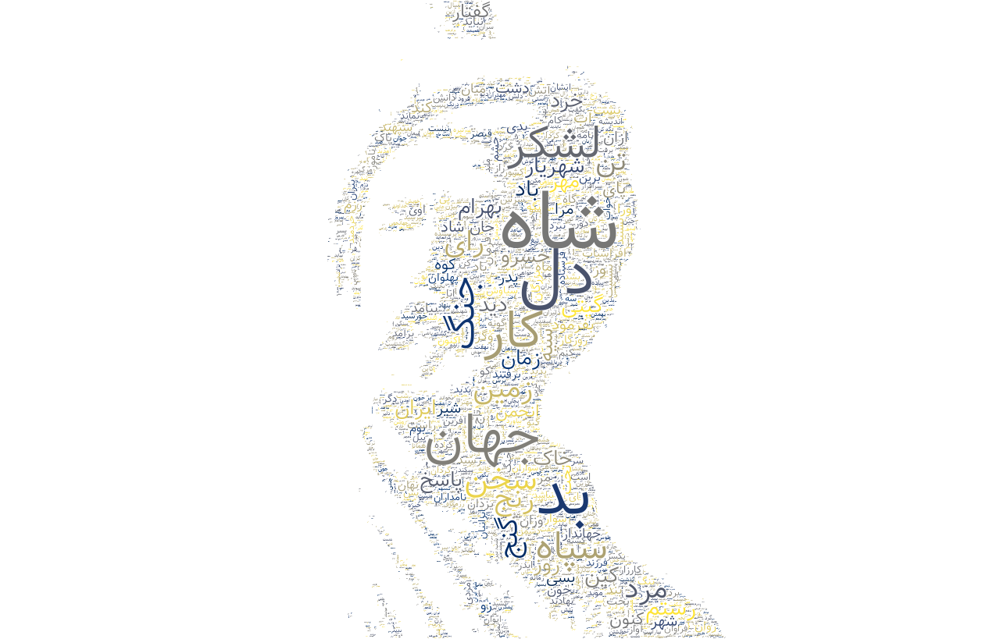
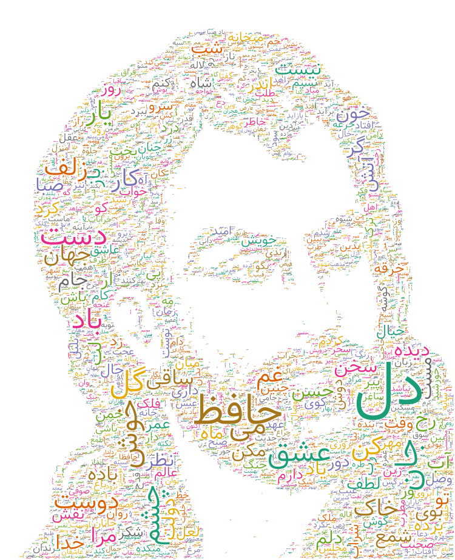
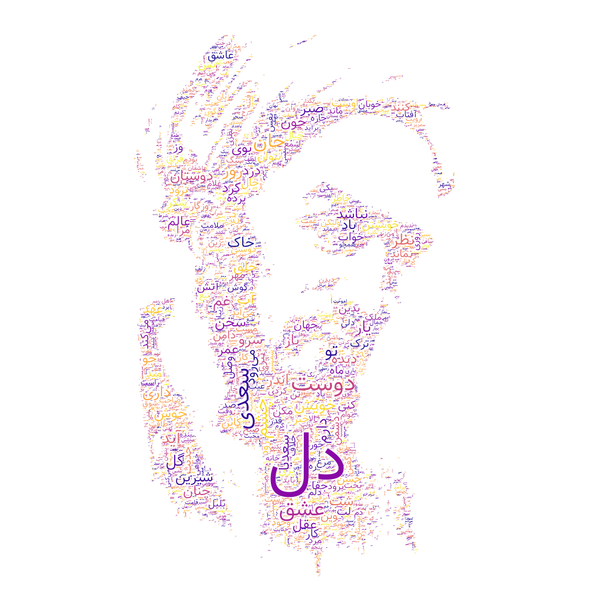

# mask_wordcloud

### Introduction
simple python script to easily generate wordcloud with arbitrary masks.
see below examples:
<!-- 

 -->

### How to use
Clone repository and run:
`pip install -r requirements.txt`
For creating wordcloud like these, you need to go three steps:
- choose your image for example for shajarian wordcloud I've choosed this image:
<!--  -->

- run `mask_generator.py` script with appropriate arguments:

`python mask_generator.py --image <path_to_image_you_want>`
this script generate an image binary mask for you. example result:
<!--  -->

- run `make_wordcloud.py` and pass your words and mask as argument:

`python make_wordcloud.py --txt texts/python.txt --mask mask.png`
this script parse your text file and generate wordcloud using your generated mask. example result:

### Notes
- you can check additional arguments by running
`python mask_generator.py --help`
or
`python make_wordcloud.py --help`

- you can see `images/guides` for choosing your wordcloud colormap.

